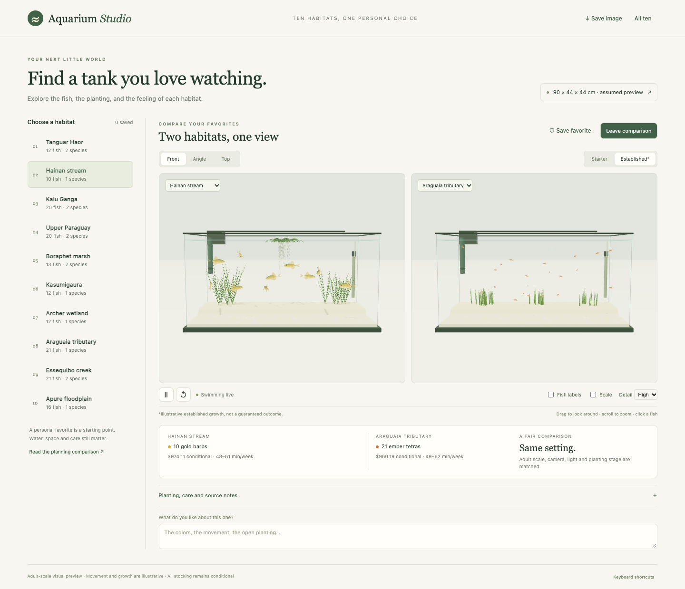
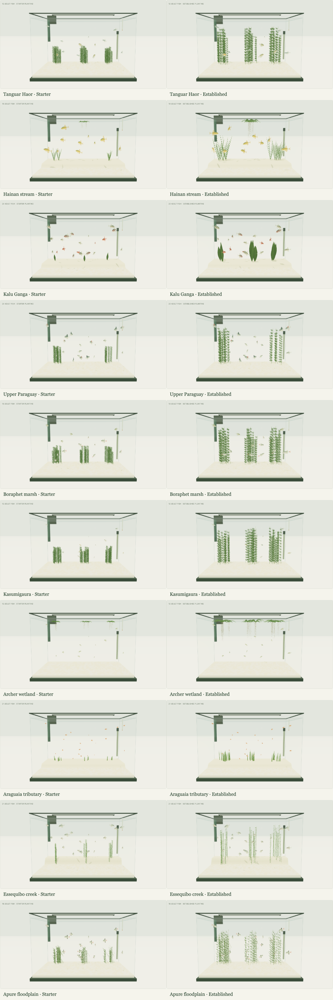

# Aquarium Studio

**Compare the aquarium you want to watch before choosing the aquarium you want to build.**

Aquarium Studio turns ten researched freshwater habitat plans into interactive 3D aquariums. Watch their proposed adult fish populations, inspect the planting, and compare two habitats with the same camera, lighting and tank dimensions.



This is a visual decision tool, not a biological prediction. The fish move; the software does not prove that a stocking plan is safe or that an aquarium will stay healthy.

## Why I started this

I’m Vivienne. My love of fish and interest in keeping natural, biotope aquariums inspired this first project; my broader goal is to build tools that help people enjoy their hobbies and find better value in the things they love.

Choosing an aquarium is more than stocking up a tank with as much attractive fish as possible. Adult size, bio-load, swimming space, plant placement, equipment cost, tank-mate compatibility, fish comfortability and maintenance all affect the result. Aquarium Studio connects those constraints to a scene you can explore rather than asking you to imagine the finished tank from a shopping list or become a scientist in order to create the perfect tank.

The project combines aquarium research, procedural graphics, configurable software design and automated verification. I set the project’s goals and requirements, including beginner-friendly stocking, realistic counts, value, simple maintenance and useful comparisons. AI assisted with research, implementation and testing. Its source, assumptions and test evidence are available here so that you can evaluate what it actually does.

## Try it locally

You need Python 3.10+ and a modern browser with WebGL2. The rendering engine and assets are included locally; running the app requires no npm installation, external CDN or account.

From the repository folder:

```sh
python3 server.py --open
```

Open **http://127.0.0.1:8765/** if your browser does not open automatically. On Windows, `py -3 server.py --open` is an alternative. Stop the server with **Ctrl+C**. If the port is occupied, use `python3 server.py --port 8770 --open`.

The server listens only on your computer. On macOS, you can also double-click `Launch Aquarium Studio.command`.

## What you can explore

- **Ten habitat plans:** exact proposed adult counts, recognizable species, selected aquarium appearances and the plants specified by each plan.
- **A fair comparison:** two tanks share geometry, camera, lighting, planting stage and simulation time.
- **Individual movement:** fish shoal loosely, explore, pause, use cover and display rather than following one repeated loop.
- **Starter and established planting:** purchased nursery units versus illustrative maintained growth, with open swimming lanes.
- **Inspection tools:** click a fish, show labels or a scale, and switch between front, angle and top views.
- **Your shortlist:** favorites and notes remain in your browser; export a scene, comparison or all-ten contact sheet as PNG.
- **Editable dimensions:** enter actual internal measurements. The app keeps fish counts unchanged and warns about an unmet space requirement.

Use **Space** to pause, **R** to reset, **F** to favorite and **1 / 2 / 3** for camera presets. Drag or use the arrow keys to look around; scroll or use **+ / −** to zoom. Light detail lowers rendering load while retaining every fish and its anatomy.

## The ten scenes

| Habitat | Proposed adult fish |
| --- | --- |
| Tanguar Haor | 4 honey gouramis + 8 zebra danios |
| Hainan stream | 10 golden gold barbs |
| Kalu Ganga | 10 cherry barbs + 10 black ruby barbs |
| Upper Paraguay | 10 black neon tetras + 10 black phantom tetras |
| Boraphet marsh | 9 red-tailed rasboras + 4 sparkling gouramis |
| Kasumigaura | 12 ornamental Japanese medaka |
| Archer wetland | 12 spotted blue-eyes |
| Araguaia tributary | 21 ember tetras |
| Essequibo creek | 12 glowlight tetras + 9 head-and-tail-light tetras |
| Apure floodplain | 16 x-ray tetras |

These are the current planning proposals, including documented commercial appearances and care conditions. A regional habitat label does not authenticate a fish's wild lineage or mean that every aquarium plant culture choice perfectly replicates nature.



## Design decisions worth inspecting

**Data before decoration.** A plan adapter preserves scientific identities, counts, size semantics, nursery quantities and source provenance. Scenes use funded sand and specified plants. Extra rocks, wood and filler plants are not added to make a plan look better.

**Separate the model from the picture.** Browser-independent tank geometry, species profiles, fish agents, habitat layouts and simulation worlds live in `src/core.js`. Rendering and UI have separate modules. Tank dimensions, behavior, appearance and rendering quality come from editable JSON rather than a single fixed scene.

**Measure in centimeters.** Standard/body length is distinguished from total length. Any visual tail allowance is labeled. Changing tank volume does not multiply stocking counts or enlarge fish.

**Give motion repeatable rules.** A seeded random generator and fixed simulation timestep make reset and cross-frame-rate checks reproducible. Shared plant structures and equipment bounds inform obstacle avoidance. Render batching reduces drawing work while retaining individual animation rigs.

**Keep uncertainty visible.** Startup estimates are dated and conditional; display dimensions are assumptions until measured. Established planting illustrates a possible maintained appearance rather than promising growth.

## Evidence, not just screenshots

The repository includes validation reports and images. See the [completion audit](validation/completion-audit.md) for the current requirement-by-requirement status, [species portraits](validation/species/all-species.png) for the procedural assets and [provenance](docs/provenance.md) for their assumptions and licenses.

The domain suite checks source mapping, adult counts, length semantics, plant units, assessed cost/work values, alternate dimensions and conserved substrate volume. Movement checks cover every plan, both planting stages and two seeds for 125 simulated seconds per case, with an additional frame-rate reproducibility check.

Browser checks exercise plan switching, controls, fish picking, matched comparison, persistent favorites and notes, geometry warnings and real PNG downloads. Separate mesh audits check fish, plant and equipment bounds. Performance measurements identify their test conditions; they are not a frame-rate guarantee for your computer.

### Run the checks

With Node 20+ installed:

```sh
npm test
```

Browser verification additionally uses the optional development dependency and an installed Chromium browser. Start the app in another terminal, then run:

```sh
npm ci
npx playwright install chromium
node tools/browser_validation.mjs
```

The browser scripts default to the Chromium installed by Playwright. Set `AQUARIUM_CHROME` to use an existing Chrome/Chromium executable, or `AQUARIUM_URL` for a different local server port. They launch an isolated headless browser, not your personal profile.

## Project map

| Location | Purpose |
| --- | --- |
| `data/plans.json` | Normalized plans and scientific/source mapping |
| `data/config.json` | Geometry, equipment, camera, behavior and quality settings |
| `data/visual-profiles.json` | Species appearance, botanical forms and layout choices |
| `src/core.js` / `src/types.d.ts` | Simulation model and data contracts |
| `src/fish-model.js` / `src/fish-school.js` | Procedural fish and independently animated batching |
| `src/plant-layout.js` / `src/plants.js` | Shared plant structures, collision geometry and rendering |
| `src/renderer.js` / `src/app.js` | Tank rendering, interaction and interface |
| `tests/` / `tools/` / `validation/` | Verification code and captured evidence |
| `vendor/` | Pinned Three.js runtime and its license |

## What this model cannot tell you

It does not calculate water quality, fish stress, compatibility, survival, breeding success or plant growth. Procedural anatomy and colors are interpretations, not 3D scans. Equipment shapes are placement proxies, not manufacturer CAD. Glass and water use real-time optical approximations, and actual fish batches may look or behave differently.

Use the simulation to compare appearances and movement, then verify real dimensions, care requirements and equipment before making a purchase.

## License and credits

Project-owned code and procedural assets are offered under **Business Source License 1.1**. Personal, educational and other noncommercial production use are permitted by the Additional Use Grant. The exact terms and conversion to the **MIT license on October 5, 2029 (or earlier under the license’s four-year limit)** are specified in [LICENSE](LICENSE). This is source-available software; BSL 1.1 is not an open-source license before conversion.

Third-party components retain their own licenses, including the locally bundled [Three.js MIT license](vendor/THREE-LICENSE.txt). Asset origins and visual assumptions are documented in [docs/provenance.md](docs/provenance.md).

Thoughtful bug reports are welcome. Include the plan, planting stage, browser/device and steps to reproduce. A screenshot or exported comparison helps make a visual issue reviewable.
